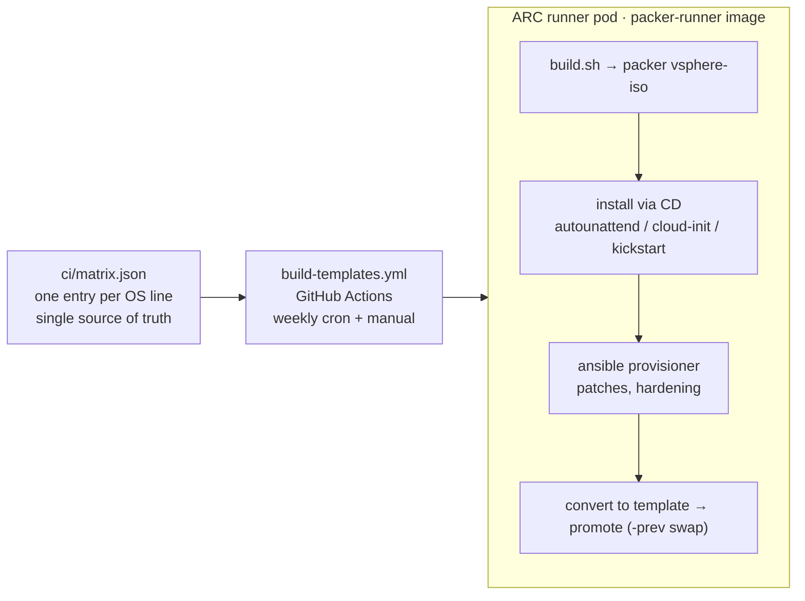

# Packer vSphere Golden Images

The **`codelooks-com/packer-vsphere`** pipeline builds multi-OS golden-image
templates for vSphere on the Talos cluster's **ephemeral ARC runners** (no
pinned build VM). The CI, runner image, and operational pipeline documented here
are ours.

## What this builds

Nine template lines — all converted vSphere templates, patched at build time and
promoted into the `Templates/` folder with a one-generation `-prev` rollback:

| Family | Lines |
|---|---|
| **Linux** (6) | Ubuntu 24.04 / 22.04, Debian 12 / 13, Rocky 9, AlmaLinux 9 |
| **Windows** (3) | Server 2025 (Datacenter, Desktop Experience), Server 2022 (Datacenter, Desktop Experience), Windows 11 (Enterprise) |

These templates are consumed downstream by `codelooks-com/terraform-vsphere`.

## How it works (at a glance)

- **`ci/matrix.json`** is the single source of truth — each OS line is one entry
  (`enabled`, `iso_url`/datastore, `build_dir`, `base_name`, …). The plan job
  filters it; `all` and the weekly cron build every `enabled` line.
- **Runner image** `ghcr.io/codelooks-com/packer-runner` carries the pinned
  toolchain (Packer, Ansible, govc, …) and runs as an ARC scale-set pod.
- **Install media** is delivered on a CD (`common_data_source=disk`) — the
  runner pod needs only egress (vCenter, SSH/WinRM), no inbound HTTP server.
- **Promote** swaps the freshly converted `<base>-build` template into the
  stable `<base>` name Terraform clones, keeping `<base>-prev` as a rollback.

## Where to start

- **[Getting Started → Requirements](getting-started/requirements.md)** and
  **[Configure](getting-started/configure.md)** — prerequisites and local config.
- **[Operations → Architecture & Pipeline](operations/architecture.md)** — the
  ARC runner, the build matrix, scheduling, and the promote/rollback model.
- **[Operations → Windows Templates](operations/windows.md)** — the
  Windows-specific build path and its hard-won gotchas (GVLK, vTPM, WinRM,
  `win_updates`).
- **[Operations → Rotate Credentials](runbooks/rotate-credentials.md)** — the
  credential-rotation runbook.

!!! note "Scope & attribution"
    This site documents *our* operational pipeline — upstream community /
    contribution / release-notes pages are intentionally omitted. The build
    engine derives from
    [`vmware/packer-examples-for-vsphere`](https://github.com/vmware/packer-examples-for-vsphere)
    (BSD-2-Clause; see [License](license.md)). Build target: vSAN Cluster ·
    `vsanDatastore` · `VM Network` · `Templates` folder · SSO domain
    `core.codelooks.com`.
